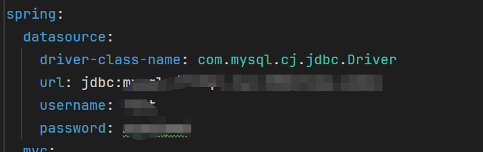

# 运行程序说明

### 前端

在运行程序之前，请确保您的计算机已满足以下要求：

- 系统环境：Windows、MacOS或Linux
- 浏览器：推荐使用最新版本的Google Chrome、Mozilla Firefox或Microsoft Edge
- nodeJS环境：推荐最新稳定版本

运行说明：

1. 下载demo
2. 在文件目录下运行 

```jsx
npm install
npm run dev
```

### 后端

在运行后端程序之前，请按照以下步骤进行准备：

运行环境要求：

- MySQL 5.7.*：请确保您的计算机已安装MySQL数据库，并且版本为5.7或更高版本。
- JDK 1.8：请确保您的计算机已安装Java Development Kit (JDK) 1.8或更高版本。

配置说明：

数据库配置：

1. 打开MySQL数据库客户端，并创建一个新的数据库。
2. 使用MySQL客户端导入cow_video.sql文件到新创建的数据库中。该文件包含了一些测试数据，您可以使用用户名test和密码123456进行登录。

配置修改：

在首次运行后端程序之前，您需要按照以下步骤修改配置文件：

1. 找到后端程序的application.yml文件，通常位于项目的根目录下。
2. 使用编辑器打开application.yml文件。
3. 在配置文件中，找到连接数据库的配置项，并修改为您的数据库地址、用户名和密码。



运行说明：

在完成上述准备工作后，您可以按照以下步骤启动后端程序：

1. 使用Maven构建工具导入项目的所有依赖包。
2. 找到并运行`CowVideoApplication`主类，该类包含了程序的入口点。
3. 等待片刻，直到控制台显示后端程序已成功启动。
